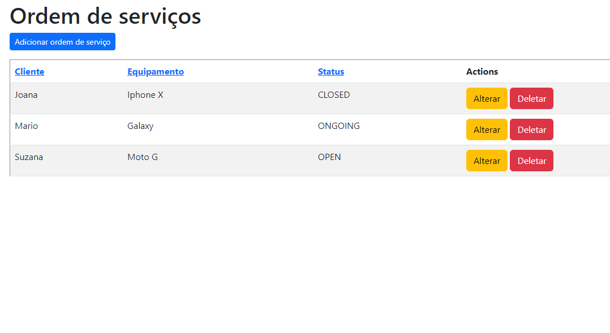
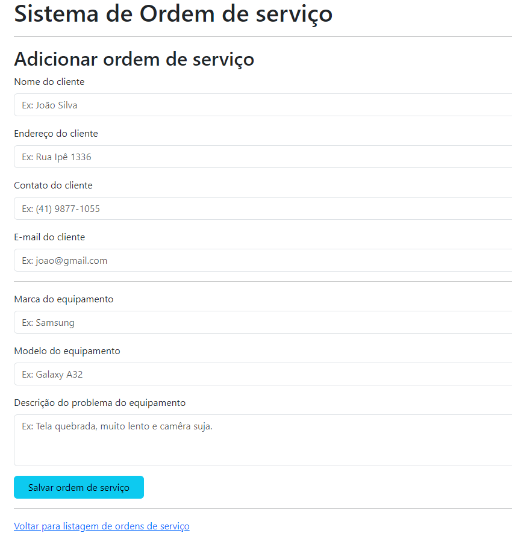
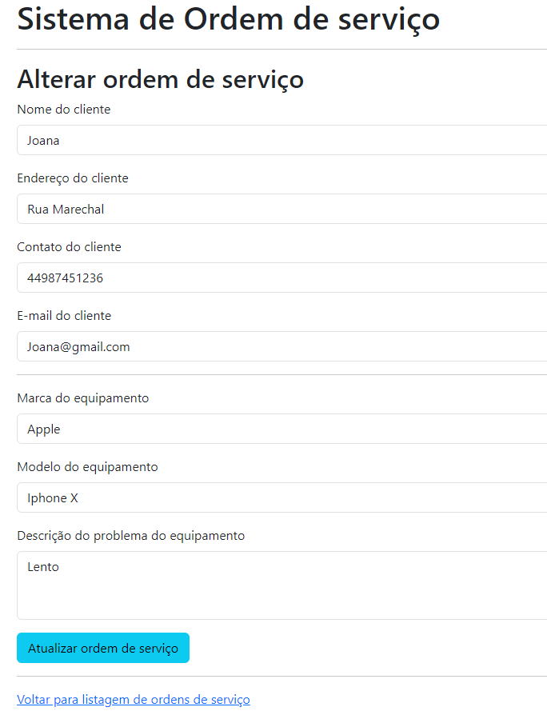

# Desafio para a vaga de Dev Java na empresa RP Info Sistemas

Aplicação REST para registro de ordem de serviço utilizando Spring boot.

## Como rodar a Aplicação
- Passo 1: Clone o repositório
```
git clone https://github.com/lucassgoes/RPInfoDesafio.git
```
- Passo 2: Abra o projeto na sua IDE e rode a classe RpInfoDesafioApplication
- Passo 3: Acesse http://localhost:8080 no seu navegador.

## Documentação API Rest
### Métodos
Requisições para a API devem seguir os padrões:
| Método | Descrição |
|---|---|
| `GET` | Retorna informações de um ou mais ordens de serviço. |
| `POST` | Utilizado para criar uma nova ordem de serviço. |
| `PUT` | Atualiza dados de uma ordem de serviço e alterar sua situação. |
| `DELETE` | Remove uma ordem de serviço do sistema. |

### Rotas
Requisições para a API devem seguir os padrões:
| Método | Rotas |
|---|---|
| `GET` | /api/workOrders |
| `POST` | /api/workOrders | 
| `PUT` | /api/workOrders/{id} |
| `DELETE` | /api/workOrders/{id} |

+ Body da requisição de POST

            {
              "clientName": String,
              "clientAddress": String,
              "clientContact": String,
              "clientEmail": String,
              "equipamentModel": String,
              "equipamentBrand": String,
              "equipamentProblem": String,
              "workOrderStatus": ENUM["OPEN", "ONGOING", "CLOSED"]
            }

+ Body da requisição de PUT neceessário inserir o campo id

            {
              "id": Long,
              "clientName": String,
              "clientAddress": String,
              "clientContact": String,
              "clientEmail": String,
              "equipamentModel": String,
              "equipamentBrand": String,
              "equipamentProblem": String,
              "workOrderStatus": ENUM["OPEN", "ONGOING", "CLOSED"]
            }
            
## Documentação das telas
### Tela de listagem de ordem de serviço

Listagem da ordens de serviço
Ações do usuário:
+ Adicionar nova ordem de serviço clicando no botão "Adicionar nova ordem de serviço"
+ Alterar ordem de serviço clicando no botão "Alterar"
+ Deletar ordem de serviço clicando no botão "Deletar"

### Tela de criação de ordem de serviço

Formulário para criação de uma ordem de serviço
Ações do usuário:
+ Adicionar as informações do cliente e do equipamento e salvar

### Tela de alteração de ordem de serviço

Formulário para alteração de uma ordem de serviço
Ações do usuário:
+ Adicionar as informações do cliente e do equipamento e salvar
